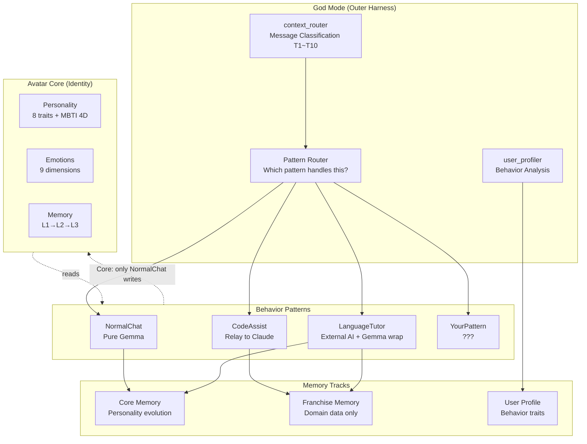
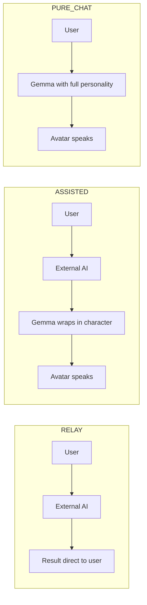

# NVatar SDK

> **Build AI-powered services on top of NVatar avatars — without touching the avatar's soul.**

NVatar SDK lets you create **BehaviorPatterns** that extend avatar capabilities while preserving their identity. Your avatar can be a code assistant, language tutor, therapist, or customer service agent — each behavior runs independently, and the avatar's personality stays intact.

**[NVatar Demo](https://nskit-io.github.io/nvatar-demo/)** · **[Code Assist Example](https://github.com/nskit-io/nvatar-code-assist)** · [한국어](docs/README_KO.md)

> ⚠️ **Preview** — SDK is functional but API may change. Currently powering Code Assist and internal test patterns.

---

## Core Principle: Identity Preservation

```
Your avatar works at different "jobs" but comes home the same person.

🏠 Home (Normal Chat)     → Personality evolves from daily conversations
💼 Job A (Code Assist)    → Relays to Claude Code, no personality change
📚 Job B (Language Tutor) → Teaches with external AI, gains domain knowledge
🏥 Job C (Therapist)      → Counsels with guided prompts, understands user better

The avatar remembers what happened at work (Franchise Memory),
but work doesn't change who they are (Core Memory).
```

---

## Architecture



---

## BehaviorPattern Interface

Every pattern implements this contract:

```python
from app.sdk.pattern import BehaviorPattern, GemmaMode, MemoryPolicy, PatternContext, PatternResult

class MyPattern(BehaviorPattern):

    @property
    def name(self) -> str:
        return "my-service"

    @property
    def gemma_mode(self) -> GemmaMode:
        # RELAY      — bypass Gemma, external AI only
        # ASSISTED   — external AI + Gemma character wrapping
        # PURE_CHAT  — full Gemma response (default)
        return GemmaMode.ASSISTED

    @property
    def memory_policy(self) -> MemoryPolicy:
        # SKIP           — save nothing
        # CORE_ONLY      — core memory only (default)
        # FRANCHISE_ONLY — franchise memory only
        # BOTH           — core + franchise
        return MemoryPolicy.BOTH

    async def should_activate(self, ctx: PatternContext) -> bool:
        """Does this pattern handle the current message?"""
        return my_service.is_session_active(ctx.avatar_id)

    async def handle(self, ctx: PatternContext) -> PatternResult:
        """Process the message and return result."""
        # 1. Call external service
        result = await my_service.process(ctx.user_text)

        # 2. Gemma wraps result in character voice (ASSISTED mode)
        messages = ctx.core_services.prompt_builder.build_messages(
            ctx.avatar_id, ctx.user_text,
            extra_context=f"[Service result: {result['feedback']}. Respond in character.]"
        )
        response = await ctx.core_services.gemma.chat_collect(messages, 256, False)

        # 3. Return with franchise events
        return PatternResult(
            response_text=response,
            franchise_events=[{
                "type": "event",
                "status": "success",
                "data": {"topic": result["topic"], "score": result["score"]},
            }],
        )

    def get_franchise_context(self, avatar_id: int) -> str | None:
        """Optional: provide context for daily conversations.
        When user chats normally, avatar can mention franchise activities."""
        return "User completed lesson 8 (Passive Voice, 80 points) yesterday."
```

---

## Three Gemma Modes

| Mode | Gemma | Use Case | Memory |
|------|-------|----------|--------|
| **RELAY** | Bypassed | External AI does everything | Franchise only (or skip) |
| **ASSISTED** | Wraps result | External AI + avatar personality | Core + Franchise |
| **PURE_CHAT** | Full response | Normal conversation | Core only |



### When to use which?

- **RELAY**: Sensitive operations (code execution, file access). No Gemma involvement = no hallucination risk.
- **ASSISTED**: Domain services (tutoring, customer support). External AI handles domain logic, Gemma adds personality.
- **PURE_CHAT**: Casual conversation. Full personality, emotion tracking, memory evolution.

---

## Memory: Three Tracks

```
Avatar
├── Core Memory (L1→L2→L3)        ← Only PURE_CHAT writes here
│   Personality evolution, MBTI drift, emotion tracking
│   "Who the avatar IS"
│
├── Franchise Memory               ← Patterns write domain data
│   Pattern-specific, no personality impact
│   "What the avatar DID at work"
│
└── User Profile                   ← God Mode analyzes behavior
    Diligence, growth rate, response preference
    "Who the USER is" (implicit, never exposed)
```

### Franchise Memory Schema

```sql
nv_franchise_memory
├── pattern_name    "ekyss", "code-assist", "therapy"
├── entry_type      "event", "state", "commitment"
├── status          "success", "failed", "pending", "ongoing"
├── relevance_score  Decays over time (event: -1/day, state: no decay)
└── data            JSON (domain-specific)
```

### save_franchise_memory Flag

Each pattern controls whether its activities are remembered:

```python
class CodeAssistPattern(BehaviorPattern):
    def __init__(self):
        super().__init__()
        self._save_franchise_memory = False  # Sensitive — don't store

class LanguageTutorPattern(BehaviorPattern):
    def __init__(self):
        super().__init__()
        self._save_franchise_memory = True   # Learning history is valuable
```

Users/partners can override at SDK connect time:

```
POST /api/v1/sdk/connect
{
    "avatar_id": 42,
    "save_franchise_memory": true   // "Store my activity for the avatar to remember"
}
```

---

## Franchise Context in Daily Chat

When your pattern provides `get_franchise_context()`, the avatar naturally references it during casual conversations:

```
User: "오늘 뭐하지?"
Avatar: "음, 일단은 밀린 영어 공부부터 조금씩 손대보는 건 어때? 📖
         너 저번에 Future Tense는 90점이나 맞았잖아! ✨"
```

The avatar knows about franchise activities but **doesn't change personality** because of them. A teacher's personality doesn't change because a student scored well — but they remember it and can mention it.

---

## Proactive Reminders

Patterns can register commitment-based triggers:

```python
def get_proactive_triggers(self, ctx: PatternContext) -> list[dict]:
    return [{
        "type": "schedule_remind",
        "condition": "commitment 'daily' missed",
        "message_hint": "Time for your English study~"
    }]
```

The Proactive Scheduler (every 30 minutes) scans franchise memory:
- `commitment` entries with `status: "ongoing"` + no today's event → reminder
- Gemma wraps reminder in avatar's character voice
- Delivered when user connects: *"앗, 벌써 2일이나 지났네! 오늘 영어 공부 슬쩍 해볼 생각 있어?"*

---

## User Profiler (God Mode)

God Mode runs **Gemma without character prompt** — pure analytical:

```
Franchise events → Gemma blind analysis → User behavior profile

Input:  10 days of learning: lesson 1~8, scores 65~90, 3-day gap
Output: { diligence: 0.95, growth_rate: "steady",
          challenge_pref: "moderate", response_style: "neutral",
          summary: "Consistent learner. Encourage achievements
                    and guide to next level naturally." }
```

The profile is **never exposed to the user**. It shapes how the avatar approaches conversation:
- High diligence → encourage, don't nag
- Low scores → supportive, not critical
- Prefers challenges → suggest harder content

---

## Pattern Registration

```python
# In chat.py (server startup)
from app.sdk.registry import PatternRegistry

registry = PatternRegistry()
registry.register(CodeAssistPattern())          # Priority 1
registry.register(LanguageTutorPattern())       # Priority 2
registry.register(NormalChatPattern(), default=True)  # Fallback
```

Registration order = priority. First match wins.

Active patterns (explicit mode toggle) take precedence:

```python
# User toggles "코드 비서모드 온"
registry.set_active(avatar_id, code_assist_pattern)

# User toggles off
registry.set_active(avatar_id, None)  # Falls back to normal routing
```

---

## Example: Code Assist (Relay Mode)

See **[nvatar-code-assist](https://github.com/nskit-io/nvatar-code-assist)** for the full working implementation.

Key characteristics:
- `GemmaMode.RELAY` — Gemma not involved in code execution
- `MemoryPolicy.SKIP` — Code work not saved to any memory track
- `save_franchise_memory = False` — Sensitive user code
- Opinion detection — "What do you think?" routes to Gemma with code context
- Activity-based timeout — Progress callbacks reset timer (long tasks OK)

---

## Example: Language Tutor (Assisted Mode)

```python
class LanguageTutorPattern(BehaviorPattern):
    name = "language-tutor"
    gemma_mode = GemmaMode.ASSISTED
    memory_policy = MemoryPolicy.BOTH

    def __init__(self):
        super().__init__()
        self._save_franchise_memory = True  # Learning history matters

    async def should_activate(self, ctx):
        return tutor_service.is_session_active(ctx.avatar_id)

    async def handle(self, ctx):
        # External AI handles lesson content
        lesson = await tutor_service.get_next_exercise(ctx.avatar_id, ctx.user_text)

        # Gemma wraps in character personality
        extra = f"[Lesson result: {lesson['feedback']}. Score: {lesson['score']}. Respond in character — encouraging but natural.]"
        messages = prompt_builder.build_messages(ctx.avatar_id, ctx.user_text, extra_context=extra)
        response = await gemma_service.chat_collect(messages, 256, False)

        return PatternResult(
            response_text=response,
            franchise_events=[{
                "type": "event", "status": "success",
                "data": {"lesson": lesson["id"], "topic": lesson["topic"], "score": lesson["score"]},
            }],
        )

    def get_franchise_context(self, avatar_id):
        # Avatar mentions learning progress in daily chat
        state = franchise_memory.get_latest_state(avatar_id, "language-tutor")
        if not state: return None
        return f"User is learning English. Level: {state['level']}. Last lesson: {state['topic']} ({state['score']}pts)."
```

---

## Best Practices

### 1. Identity Preservation
- **Don't** modify avatar traits/emotions from your pattern
- **Don't** save domain data to core memory
- **Do** use franchise memory for domain state
- **Do** let `get_franchise_context()` bridge domain knowledge to daily chat

### 2. Sensitive Data
- Set `save_franchise_memory = False` for code, financial, or medical data
- Use pattern-specific storage (SQLite, external DB) for sensitive results
- Code Assist uses separate `code_results.db` — never touches franchise memory

### 3. Gemma Mode Selection
- **RELAY** when you need deterministic execution (code, API calls)
- **ASSISTED** when avatar personality adds value (teaching, customer support)
- **PURE_CHAT** only for NormalChatPattern — this is where personality lives

### 4. Memory Policy
- `SKIP` for transient interactions (mode toggles, monologue)
- `CORE_ONLY` for conversations that shape the relationship
- `FRANCHISE_ONLY` for domain data without relationship impact
- `BOTH` for assisted mode — conversation is recorded, domain data tracked separately

### 5. Proactive Behavior
- Use `get_proactive_triggers()` for commitment-based reminders
- Don't spam — scheduler has 12-hour rate limit per trigger type
- Let Gemma wrap messages in character voice (never raw template text)

---

## SDK Connect API

```
POST /api/v1/sdk/connect
{
    "avatar_id": 42,
    "context_append": false,
    "character_wrap": true,
    "save_franchise_memory": true
}
```

| Parameter | Default | Description |
|-----------|---------|-------------|
| `avatar_id` | required | Avatar to connect |
| `context_append` | `false` | Append external context to Gemma prompt |
| `character_wrap` | `true` | Wrap external results in character voice |
| `save_franchise_memory` | pattern default | Override pattern's memory storage setting |

---

## Related Projects

| Project | Description |
|---------|-------------|
| [nvatar-demo](https://github.com/nskit-io/nvatar-demo) | NVatar core — 3D avatar chat with personality, memory, emotion |
| [nvatar-code-assist](https://github.com/nskit-io/nvatar-code-assist) | Code Assist — Claude Code integration via BehaviorPattern (RELAY mode) |
| [portable-ai-companion](https://github.com/nskit-io/portable-ai-companion) | Vision & roadmap for portable AI characters |

---

## License

- **SDK code & examples**: MIT — free to use, modify, and distribute commercially
- **NVatar platform architecture & design documents**: Proprietary — not included in this repository. Contact [nskit@nskit.io](mailto:nskit@nskit.io) for commercial licensing.

---

Built by [Neoulsoft](https://nskit.io) — AI-Native Framework
